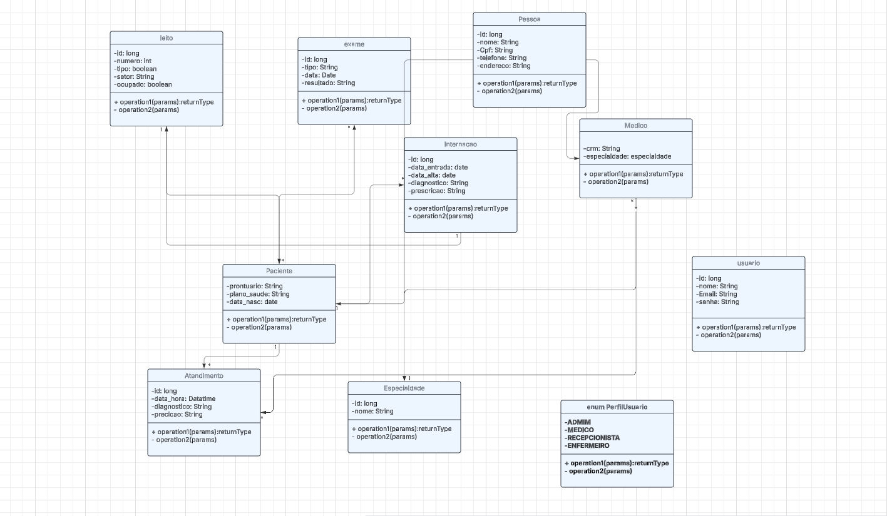

# 🏥 Hospital Management System

Este é um projeto de sistema hospitalar com uma **API RESTful em Spring Boot** e um **front-end simples em HTML + JavaScript**, criado com foco em aprendizado de arquitetura em camadas e integração com front-end.

---

## 🎯 Objetivo

Permitir o cadastro e listagem de pacientes, e servir como base para desenvolvimento de funcionalidades mais complexas, como gerenciamento de atendimentos, internações, médicos e históricos clínicos.

---

## ✅ Funcionalidades

- Cadastro de pacientes (nome, CPF, plano de saúde, data de nascimento)
- Listagem de pacientes em tempo real no front-end
- Integração front-end ↔️ back-end usando `fetch API`
- Arquitetura organizada (Controller → Service → Repository)

---

## 🚧 Desafio em andamento

### resolver problemas na coneção do frontend com o backend
### Endpoint a ser desenvolvido:

GET /api/pacientes/{id}/historico

Este endpoint deverá retornar os **atendimentos** e **internações** associados ao paciente pelo seu ID.

### Tarefas pendentes:

- Criar as entidades `Atendimento` e `Internacao`
- Mapear corretamente os relacionamentos com `Paciente`
- Implementar a lógica no `Service` e `Controller`
- Retornar os dados no formato JSON

---

## 🛠️ Tecnologias Utilizadas

- Java 17
- Spring Boot 3.x
- Spring Web
- Spring Data JPA
- H2 Database
- HTML5 + CSS3 + JavaScript
- Live Server (VS Code)

## 🗂️ Estrutura do Projeto (Front-End)

 HOSPITALSYSTEMAPI/
├── index.html
├── css/
│ └── style.css
├── js/
│ ├── api.js
│ └── pacientes.js
├──pages
├──assets

## 📊 Diagrama de Classes

## ✍️ Autor
Desenvolvido por João Paulo como parte de um desafio prático para consolidar conhecimentos em Spring Boot e desenvolvimento web full-stack.

